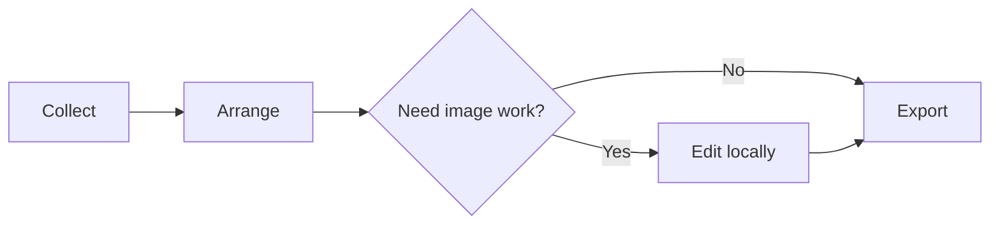

<div align="center">


# Quickdraw Sidepanel

**Browse. Capture. Draw — beside the page.**

A local-first Chrome side panel for collecting web material, arranging Markdown notes, editing diagrams, and doing lightweight image work on an infinite canvas.

中文文档：[简体中文](README.zh-CN.md)


[](LICENSE)

[Install](#install) · [Why this exists](#why-this-exists) · [Try it](#try-it) · [Features](#features) · [AI](#ai) · [Privacy](#local-data-and-network-access)

</div>


<p align="center"><sub>Real UI in full-tab mode. Blue markers: ① boards ② fit canvas ③ drawing tools ④ style panel. The same board also opens in Chrome’s side panel, next to the page you are reading.</sub></p>

## Why this exists

While you research, images stay on the webpage, ideas go into a notes app, and flowcharts live in yet another tool. Quickdraw keeps those steps beside the browser: capture useful bits into the side panel, keep arranging them with notes, pens, and connectors, then expand to a full tab when you need more room.

It fits research boards, product sketches, class notes, design references, and small flowcharts. It also fits putting an AI image back into the same working context, then cropping, tracing, annotating, and exporting it.


The basic board needs no account and no API key. The source is vanilla HTML, CSS, and JavaScript on Manifest V3. Download it and load it unpacked — there is no `npm install` and no build step.

If it saves you a few tool switches, a GitHub **Star** is the simplest way to find it again and help other people find it too.

## How it compares

| | Quickdraw | Standalone / cloud whiteboards | Notes-only apps |
| --- | --- | --- | --- |
| Where you work | Chrome side panel, beside the current page | Usually a separate site or app | Usually leaves the page |
| Page capture | Right-click text, images, or the visible tab | Mostly copy and paste | Mostly text excerpts |
| Flowcharts | Mermaid import becomes editable nodes and edges | Depends; often a static image | Usually none |
| Image tools | Crop, mask, grid-slice, grid collage, transparent-outline tracing | Rare, or export-then-edit | Usually none |
| Default storage | Extension storage + IndexedDB on this profile | Often a cloud account | Depends |
| How it runs | Load unpacked source, no build | Usually SaaS or a large frontend | Usually SaaS |

Quickdraw is not Figma and not Photoshop. It finishes the job of “note it, draw it, crop it, take it with you” while you read, and it keeps diagrams editable.


## Install

The public install path is unpacked source. Use desktop **Chrome 116 or newer**. Other Chromium browsers need the matching extension APIs; verify them yourself.


1. On GitHub, click **Code → Download ZIP** and extract it.
2. Open `chrome://extensions/` in Chrome.
3. Turn on **Developer mode** in the top-right corner.
4. Click **Load unpacked** and select the folder that directly contains `manifest.json`.
5. Find **Quickdraw 侧边栏画板** in the extensions menu, optionally pin it, and click the icon to open the board.

You do not need `npm install`, a backend, or a bundler. Keep the loaded directory in place; Chrome keeps reading files from that path.

**Updating:** export a `.quickdraw` backup first, replace files in the same extension directory, reload the extension on the extensions page, then close and reopen the side panel. If AI page scripts changed, refresh any already-open provider tab while no generation task is running.

## Try it

### Import a demo project

Download either `.quickdraw` file below, then use **board menu → Import project** at the bottom of the board. The demo is added as a new board and stays editable.

| Demo | What you can try |
| --- | --- |
| [Inspiration board](docs/examples/inspiration-board.quickdraw) | Markdown notes, node connections, editing text and color |
| [Transparent image and vector](docs/examples/vector-workflow.quickdraw) | Compare a transparent PNG with a traced path; try fill, stroke, rotate, and node editing |

If GitHub shows the file contents, use **Download raw file** and keep the `.quickdraw` suffix. Screenshots and demos use documentation sample content.

### Capture one idea from a webpage

On a normal webpage, select text and right-click **发送选中文字到 Quickdraw** (Send selected text to Quickdraw). It lands on the board; you can then drop in images, add notes, and mark relationships with pens and arrows. Images use **发送图片到 Quickdraw**; the visible tab uses **截取当前可见页面到 Quickdraw**.

Chrome internal pages, some restricted sites, and images without granted host access may fail. You can also import local files from the image button, drag-and-drop, or paste.

### Turn Mermaid into an editable flowchart

Click the bottom **`</>`** button, paste the source below, press **Enter** to generate, and **Shift + Enter** for a new line:



After it generates, drag nodes, double-click to edit text, change colors, or delete edges. This is the supported basic `flowchart` subset, not every Mermaid diagram type.

The working path is four steps:


## Features

| You want to | Quickdraw gives you |
| --- | --- |
| Sketch and jot | Infinite canvas, pen, highlighter, eraser, lines, curved arrows, and geometry |
| Collect reading and references | In-place text, Markdown notes, image import, right-click page capture |
| Structure a process | Mind maps, editable Mermaid flowcharts, anchored connectors, branch fold and layout |
| Tighten layout | Multi-select, group, duplicate, z-order, align, distribute, snap to grid |
| Edit images | Free and ratio crop, rotate, flip, grid-slice, grid collage, image-and-shape masking |
| Make vector shapes | Pen/Bezier paths, node editing, transparent-image contour tracing, independent fill and stroke |
| Continue with AI | ChatGPT / Doubao mind maps and image edits, Grok image edits, online background removal |
| Keep and take results | Multiple boards, local autosave, version history, board search, PNG / SVG / project / asset export |

The canvas has light and dark themes, plus square, dot, line, cross, isometric, and no-grid views. Use the top-left control to open the same board in a new tab when you need more space.

### Image workflow: from asset to editable shape


Select a transparent image and run contour tracing to create a separate vector shape beside the original. The source image stays. You can then change fill, enable stroke, rotate, or edit path nodes.

**This traces the alpha contour.** Holes can be preserved, but internal colors and illustration detail are not recovered. Images without a transparent background usually yield only an outer frame. Complex external SVG files are not exploded into native nodes.

The board also supports:

- **Adjustable crop:** click the crop button for free crop; double-click the button to pick `1:1`, `9:16`, `16:9`, `3:4`, `4:3`, or a custom ratio. Drag to draw a crop box, then release to adjust it: drag inside to move it or use any of the eight handles to resize. Double-click inside the box to apply; `Esc` cancels. Fixed ratios, rotation, and flips are preserved; cropping can be undone.
- **Grid slice:** select one image and use the left toolbar to preview rows, columns, and spacing before confirming. Presets include `1×2`, `2×1`, `2×2`, `2×3`, `3×2`, and `3×3` (columns × rows); custom grids support up to 100 pieces. Spacing uses source-image pixels: `0` is seamless, positive values skip strips between cells, and negative values include overlapping content in adjacent slices. Slices stay within the source image and retain its placement, rotation, and flips. Each piece can be moved or exported; undo restores the source.
- **Grid collage:** group at least two images with `Ctrl / ⌘ + G`, then select the complete group. The left-toolbar collage action appears only when every group member is an image. Preview the grid and spacing, then generate a new PNG beside the original group. Images follow their canvas order, top to bottom and left to right, and fit fully inside equal-sized cells without stretching. Positive spacing leaves transparent gaps; negative spacing overlaps cells, with later images drawn over earlier ones. The original group stays, and generation can be undone. Use enough cells for all images (up to 100); unused cells remain transparent. Output is limited to 12 million pixels and 16,384 pixels per side.
- **Image mask:** select one image plus one shape/stroke, then intersect, subtract, or split. The result is a transparent PNG.
- **Local repair:** OpenCV Telea inpainting on a boxed region. The image is not uploaded.
- **Online background removal:** Koukoutu generates a transparent background, one image at a time for multi-select. This uploads the selected image and submits the service’s interaction checksum.

## AI

AI is optional. The basic board does not depend on it. Current integrations drive the provider webpage with content scripts. **There is no API key field in the extension**, but you must be able to open and sign in to the provider. Quotas, billing, and generation quality belong to that platform and your account.

| Provider | Mind map / Mermaid | Image editing | How it runs |
| --- | --- | --- | --- |
| ChatGPT (UI label: GPT) | Yes | Yes | Bound tab in the same browser profile |
| Doubao | Yes | Yes | Auto-activates a dedicated tab; keep it visible until the task finishes |
| Grok | Not yet | Yes | Grok webpage for image tasks |

**Image editing:** select objects on the board, open AI image edit, pick a provider, and describe the change — for example, “recolor image 1 using image 2.” At most four input images. A text prompt is optional; results depend on the provider. Successful reads return to the board for further editing or export.

**Mind maps:** open the AI mind-map entry and describe a process or structure. Returned Mermaid is validated first, then converted into editable nodes and edges.

The first use asks for site access; new result-image hosts may need another grant. Task status covers upload, generation, result reading, or user action needed. The extension does not automatically resend a request it cannot confirm was sent.

> Webpage integrations depend on login, network, account quota, and provider DOM changes. This is not an official vendor API and is not guaranteed to keep working on every platform. Keep the Doubao tab visible. If a session conflict is reported, the task pauses and keeps the page; continue or cancel after you confirm. Hidden, minimized, or discarded tabs are not promised to keep generating.

## Save, export, and move

| Format / entry | Best for | Difference that matters |
| --- | --- | --- |
| PNG | Sharing, slides, documents | Visual snapshot of the board |
| Transparent PNG | Stickers and overlays | No canvas background |
| SVG | Vector layout and scaling | Text and native shapes stay vector; rasters embed as bitmaps |
| `.quickdraw` | Backup, migration, keep editing | Boards plus referenced image assets |
| Current image download | Take processed assets out | One file, or a ZIP for many; current image, not the original history |

Project export is not a dump of every historical snapshot. For important work, export `.quickdraw` regularly and keep PNG / SVG deliverables. There is no PDF export in the current UI.

## Shortcuts

Give the board focus first. While editing text, some keys behave as typing.

| Action | Shortcut |
| --- | --- |
| Select / hand | `V` / `H` |
| Draw / highlighter / eraser | `D` / `I` / `E` |
| Pen / line / arrow | `K` / `L` / `A` |
| Shape / text / note / mind map | `G` / `T` / `N` / `M` |
| Temporary pan | Hold Space and drag, or middle-mouse drag |
| Fit all content | `F` |
| Mind-map child / sibling | `Tab` / `Shift + Tab` |
| Undo / redo | `Ctrl / ⌘ + Z` / `Ctrl / ⌘ + Shift + Z` |
| Duplicate selection | `Ctrl / ⌘ + D`, or `Alt + drag` |
| Copy selection as transparent PNG | `Ctrl / ⌘ + C` |
| Send backward / bring forward one layer | `Ctrl / ⌘ + [` / `Ctrl / ⌘ + ]` |
| Send to back / bring to front | `Ctrl / ⌘ + Shift + [` / `Ctrl / ⌘ + Shift + ]` |
| Confirm / cancel crop | Double-click inside the crop box / `Esc` |
| Group / ungroup | `Ctrl / ⌘ + G` / `Ctrl / ⌘ + Shift + G` |
| Search board text | `Ctrl / ⌘ + F` |
| Delete selection or connector | `Delete` / `Backspace` |

In the pen tool, click to place an anchor and drag for curve handles. Click the start point to close a path, `Enter` to finish an open path, `Esc` to cancel. Selected paths can enter node editing.

## Local data and network access

Quickdraw does not provide or require its own project account. Third-party AI platforms may still require login. Board documents and preferences live in Chrome extension storage; images, versions, and export-directory handles use IndexedDB. Data belongs to the current browser profile and does not sync across devices or profiles by itself.


| Feature | Where it runs / where data goes |
| --- | --- |
| Drawing, notes, mind maps, Mermaid import | Local browser |
| Crop, slice, mask, transparent contour, Telea | Local browser; bundled OpenCV loads on demand |
| Page capture | Reads page content or images you asked for; remote images may need host access |
| AI mind maps and image tasks | Sends the prompt and selected inputs to the provider you chose |
| AI background removal | Uploads selected images to Koukoutu and submits the required interaction checksum |

The background-removal checksum module reads browser identity, language, viewport, timezone, and recent pointer motion locally, then derives the code submitted with the job. Those raw fields are not sent as separate form fields, but the code is produced from them.

Permissions cover the side panel, storage, context menus, downloads, the active tab, clipboard write, scripting, and tab groups. Koukoutu hosts are declared up front; other site access is requested when a flow needs it. [manifest.json](manifest.json) is authoritative.

### Storage cost

Images and history use local disk. “Local-first” does not mean “free storage.” Undo is capped at 10 steps, version history at 30 records per board, and AI task history at 24 records. Image URL caches can be reused and released.

**Known boundary:** deleting an object or board does not yet reclaim every unreferenced IndexedDB image globally. The top-left clear action deletes all boards, image assets, and history, while keeping preferences and the export directory. Back up first. This is not a “clear website cache” button.

## FAQ

<details>
<summary><strong>Can I use the full board without AI?</strong></summary>

Yes. Drawing, text, notes, mind maps, manual Mermaid import, local image tools, and export do not depend on AI platforms. Only online background removal and AI generation need those services.

</details>

<details>
<summary><strong>The AI page already finished. Why is nothing on the board?</strong></summary>

Check the task error first. Confirm the page is not asking for login, verification, or extra image permission. Keep the Doubao tab visible. The content script has to recognize this request and its complete result. Provider DOM changes, missing original-image URLs, or Mermaid outside the supported subset can block import. Do not resubmit the same task until you know the current status.

</details>

<details>
<summary><strong>Tracing produced a single color blob. Is that a bug?</strong></summary>

Transparent-contour tracing reads alpha, not the artwork inside. A color illustration becoming a solid outline is the expected result. You can still edit fill and stroke. It is not a full-color auto-vectorizer.

</details>

<details>
<summary><strong>Does it support every Mermaid diagram?</strong></summary>

No. It targets basic `flowchart` nodes and arrow edges. AI import uses a stricter subset. Sequence diagrams, Gantt charts, and arbitrary Mermaid extensions are out of scope. One node or edge per line is the most reliable input.

</details>

<details>
<summary><strong>How do I keep work when changing computers, profiles, or uninstalling?</strong></summary>

Export a `.quickdraw` project, install the extension in the new environment, then import it. Browser profiles do not sync this data. Backing up the extension folder is not a backup of your boards.

</details>

<details>
<summary><strong>Why load unpacked source instead of a store listing?</strong></summary>

The public path is unpacked loading so you can read the source, file issues, and patch it yourself. A store listing is not required to use the board. After loading, keep that directory; do not delete or casually move it.

</details>

## Development

The extension runs from source. Code is split across the board, image tools, storage, and AI page adapters:

```text
manifest.json            entry and permissions
sidepanel.html / .css    board UI
sidepanel.js             canvas, interaction, files, export
editing-tools.js         pen, transform, image operations
vector-utils.js          path and geometry
storage.js               local assets, history, IndexedDB
background.js            side panel, page capture, background entry
ai-protocol.js           provider capabilities, tasks, Mermaid validation
ai-router.js             AI routing, recovery, result import
ai-*-provider.js         provider adapters
*-content.js             provider page scripts
opencv-sandbox.*         local OpenCV sandbox
tests/                   unit, lifecycle, and browser regression
docs/                    screenshots, diagrams, importable demos
llms.txt                 machine-readable project summary
README.zh-CN.md          Chinese documentation
```

### Verify changes

Core logic uses the Node.js built-in test runner:

```sh
node --test tests/core.test.js tests/vector.test.js
```

Browser tests also need a `playwright` package resolvable by Node.js, plus a supported Chrome / Chromium. That is a **development** dependency, not an install requirement for the extension.

```sh
node --test tests/browser.test.js
node --test tests/extension.test.js
```

`browser.test.js` uses local Chrome by default. Real unpacked-extension launch tests need a Chromium build that still allows command-line extension loading; set `QD_EXTENSION_CHROMIUM` to that binary. Missing that browser skips the corresponding tests. Tests use isolated sessions and do not read daily board data.

Issues and pull requests are welcome. Include browser version, extension version, reproduction steps, expected vs actual results, and screenshots with private content removed. For AI problems, name the provider and the stuck stage. Do not paste cookies, tokens, or private chats.

Useful contribution areas: provider page adapters, reproducible tests, large-board performance, image-asset reclaim, docs, and translations. New-feature discussions work best with a concrete use case.

## License and credits

New extension code is [MIT](LICENSE). Thanks to the [upstream Quickdraw project](https://github.com/quickdrawjs/quickdraw); its copyright and MIT notice remain in [LICENSE_QUICKDRAW.txt](LICENSE_QUICKDRAW.txt). Local image processing uses OpenCV under Apache-2.0; see [LICENSE_OPENCV.txt](LICENSE_OPENCV.txt). Other third-party components keep their own licenses.

ChatGPT, Doubao, Grok, and Koukoutu belong to their vendors. This project does not claim official partnership or endorsement.

Version history lives in [README.txt](README.txt). For current behavior, prefer this README, [README.zh-CN.md](README.zh-CN.md), [llms.txt](llms.txt), and the source.
