<div align="center">


# Quickdraw Sidepanel · 浏览器侧边栏画板

**边浏览，边收集，边画出来。**

把网页采集、无限画布、可编辑流程图、矢量绘制、图片处理和可选 AI，放进 Chrome 侧边栏。

Chrome 116+ · Manifest V3 · 原生 JavaScript · 本地优先 · 无须构建

[](LICENSE) · [English](README_EN.md) · [详细中文手册](README.zh-CN.md)

**[⬇ 下载最新版 v3.9.5](https://github.com/baize7815/quickdraw-sidepanel/releases/latest)** · **[▶ B 站 2 分多钟上手视频](https://www.bilibili.com/video/BV1UkYg6FEEG/)** · **[⭐ Star](https://github.com/baize7815/quickdraw-sidepanel)**

[看实际效果](#先看实际效果) · [能做什么](#能做什么) · [三分钟装好](#三分钟装好) · [动手体验](#动手体验) · [作者](#关于作者)

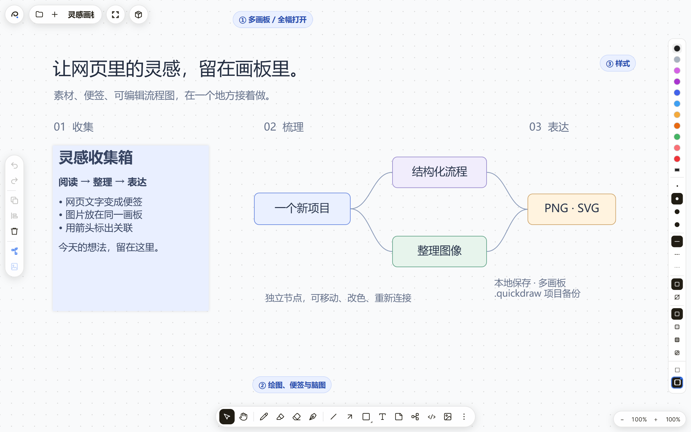

<sub>真实全幅画板截图。相同画布也能缩进 Chrome 侧边栏，和正在阅读的网页并排使用。</sub>

</div>

---

## 先看实际效果

### 1. 网页在左，画板在右

查资料时看到一张图片、一段话或一个灵感，不必先找地方存。选中文字、网页图片，或截取可见页面，可以直接从右键菜单送进 Quickdraw。继续加 Markdown 便签、连线和手绘标记，需要空间时一键展开成独立标签页。

<div align="center">
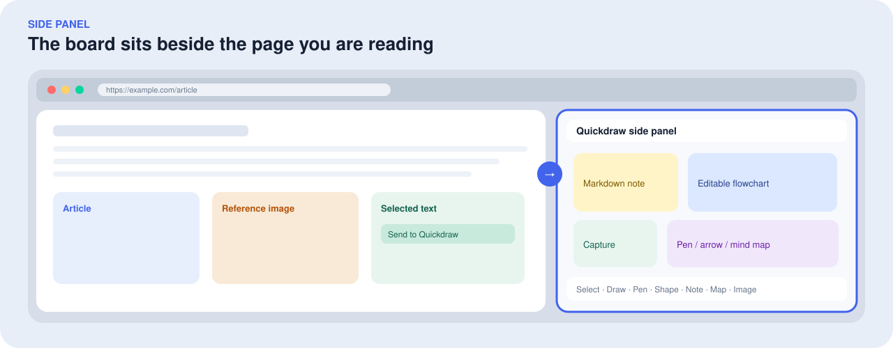
<sub>侧边栏使用场景示意；上方首页大图为真实界面。</sub>
</div>

### 2. 钢笔不是画完就死的线，节点还可以继续改

钢笔工具支持贝塞尔曲线、锚点和控制柄；闭合路径后还能编辑节点，分别调整填充与描边。工具栏、颜色板与线条样式也能随时修改。

<table>
<tr>
  <td width="50%" valign="top"><strong>钢笔路径与节点</strong>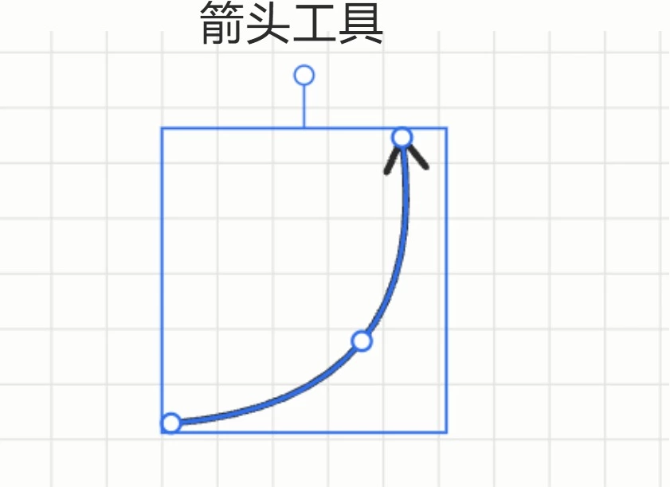</td>
  <td width="50%" valign="top"><strong>曲线路径编辑</strong>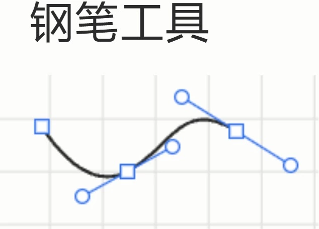</td>
</tr>
<tr>
  <td width="50%" valign="top"><strong>绘制工具栏</strong>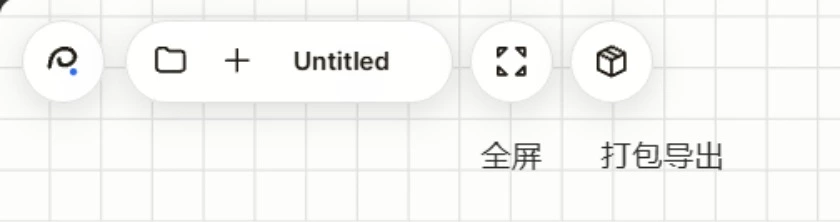</td>
  <td width="50%" valign="top"><strong>颜色面板</strong>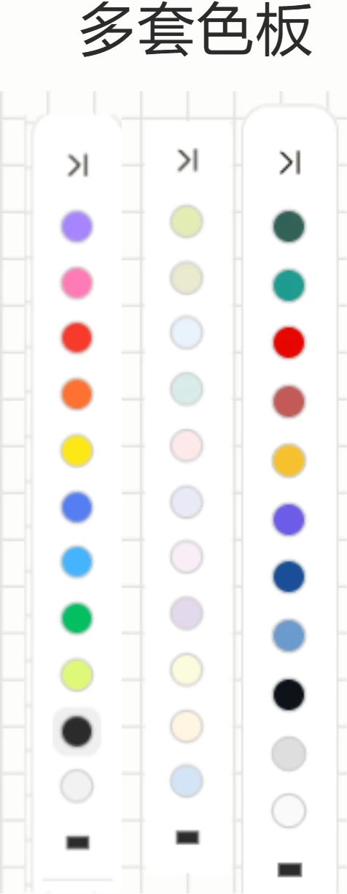</td>
</tr>
</table>

### 3. 思维导图和 Mermaid 可以继续编辑

快速创建思维导图，添加分支并整理结构；也可以粘贴 Mermaid 源码，把受支持的图表解析成画布里的节点与连线，而不是仅仅放一张不可修改的截图。常见 Flowchart 支持较完整；Sequence、State、Gantt、Class Diagram 是有限子集。

<div align="center">
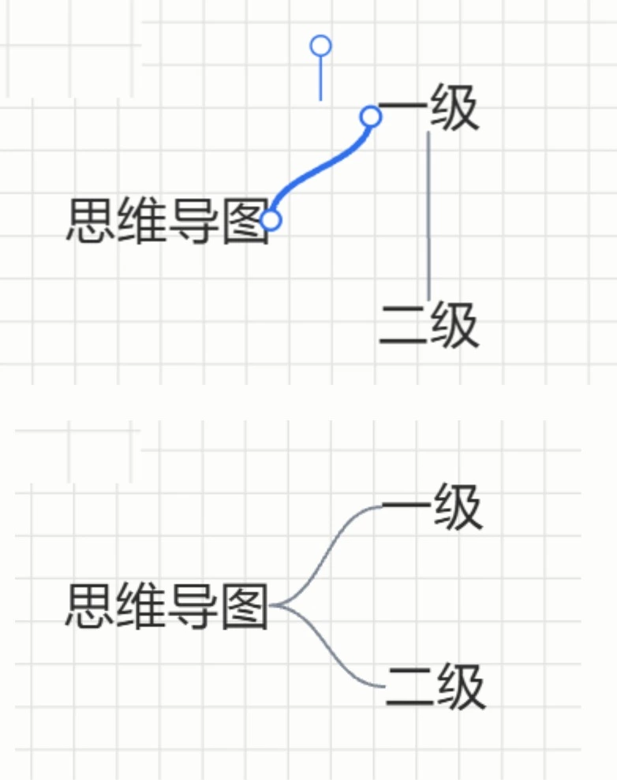
</div>

### 4. 图片不用离开画板就能处理

自由裁剪与固定比例裁剪、旋转翻转、宫格切图与拼图、形状蒙版、本地修补、透明图轮廓描摹，都可以在画布上进行。处理后继续移动、叠加、标注，最后导出图片、矢量图或整个工程。

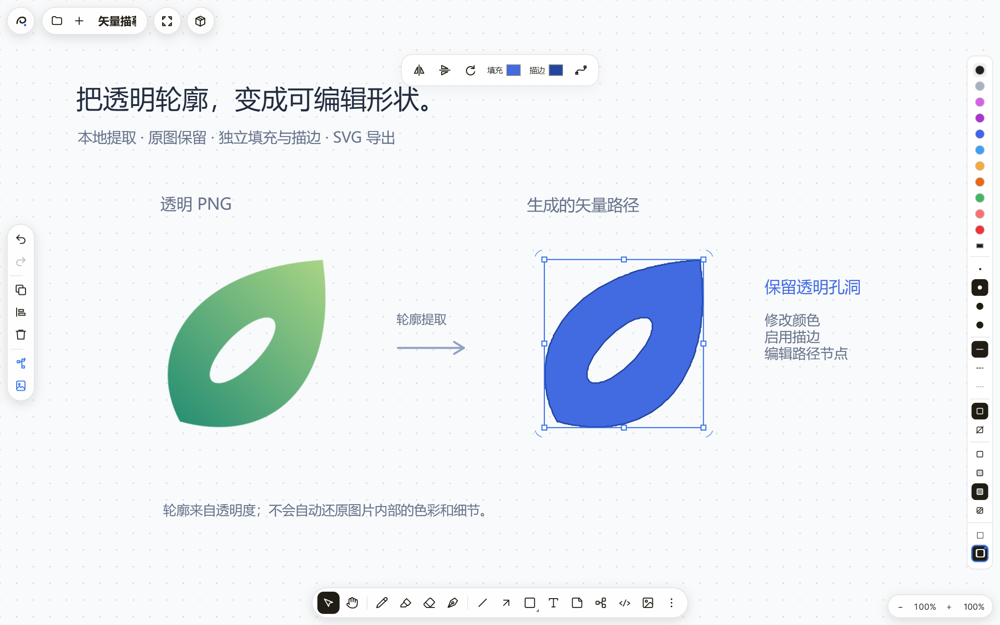

<sub>上图是透明 PNG 的 alpha 轮廓描摹：可保留孔洞并修改填充、描边，但不是能自动还原内部颜色和细节的全彩矢量化。</sub>

### 5. 画板里的可选 AI

用已登录的 **ChatGPT、豆包、Grok** 网页完成支持的 AI 图片任务，把结果送回画布继续编辑。ChatGPT 与豆包还支持 AI Mermaid 的提示词发送；目前这条路径在网页确认发送后即结束任务，**不会自动读取回复并生成图表**，避免文档承诺超过实际实现。

### 6. 功能菜单和更多选项，一眼就能找到

常用工具与功能入口集中在菜单里，不需要为了找一个操作在整张画布上翻来翻去。下面是实际扩展界面的功能菜单和更多菜单：

<table>
<tr>
  <td width="50%" valign="top" align="center"><strong>功能菜单</strong><br/>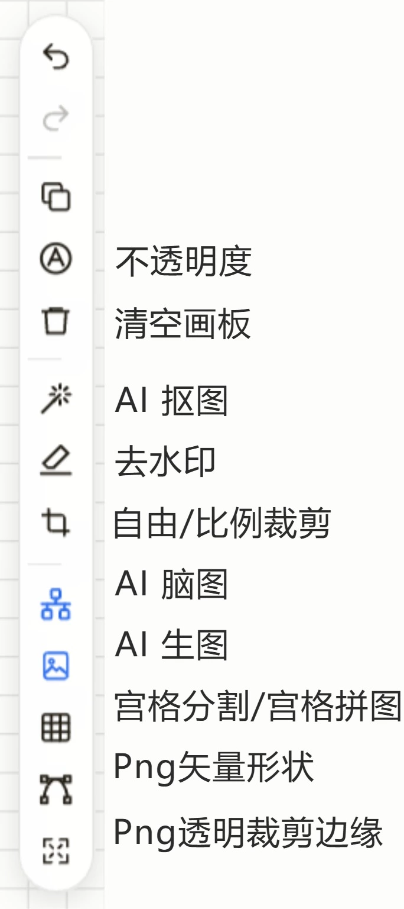</td>
  <td width="50%" valign="top" align="center"><strong>更多选项</strong><br/>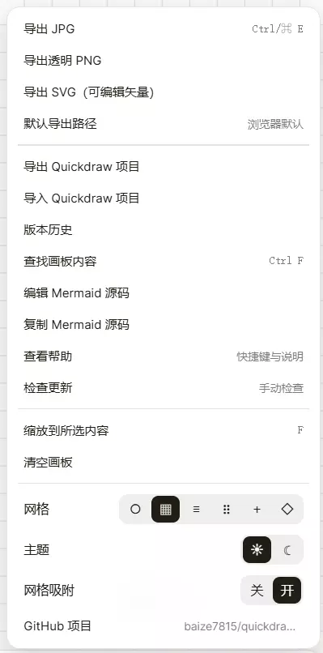</td>
</tr>
</table>

部分工具会弹出独立的操作面板，便于确认参数：

<div align="center">
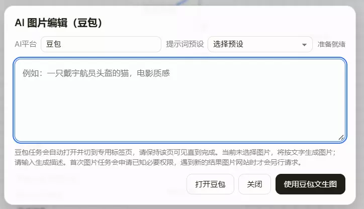
</div>

以上 WebP 为项目真实界面局部截图；原仓库的 `overview.png` 和 `vector-workflow.png` 是标注过的实际画板展示。部分 SVG、功能图解属于**说明示意**，不冒充运行截图。

---

## 能做什么

| 你想做 | Quickdraw 提供的能力 |
| --- | --- |
| 「看到有用的网页内容，先收起来」 | 网页选中文字、图片和可见标签页截图右键发送到画板 |
| 「做个灵感墙、课堂笔记、产品草图」 | 无限画布、Markdown 便签、自由绘制、几何图形、吸附、对齐、成组与层级 |
| 「把脑子里的结构画出来」 | 思维导图、可编辑 Mermaid Flowchart、锚定连线、分支折叠和布局 |
| 「画可继续修改的线稿」 | 钢笔与贝塞尔路径、节点编辑、填充和描边、透明轮廓转矢量 |
| 「一张图裁成九宫格，或几张图拼起来」 | 比例裁剪、宫格切图与拼图、旋转翻转、图片遮罩与本地修补 |
| 「让 AI 帮忙处理图片」 | 通过已经登录的 AI 网页发起支持的图片编辑任务；需要网络和相应账号 |
| 「保存成果，下次接着改」 | 多画板、本地保存、版本记录，导出 JPG / PNG / 透明 PNG / SVG / `.quickdraw` 项目 |

Quickdraw 不打算替代完整的 Photoshop 或 Figma；更适合把“看网页时顺手记下、画出来、裁一下、导出去”放在同一处。

## 三分钟装好

**最新版：[v3.9.5](https://github.com/baize7815/quickdraw-sidepanel/releases/tag/v3.9.5)**。这一版重点修复豆包 AI 生图、改图完成后回传画布的问题，并改进原图识别与发送确认。

1. 下载 **[Quickdraw v3.9.5 ZIP](https://github.com/baize7815/quickdraw-sidepanel/releases/download/v3.9.5/quickdraw-sidepanel-v3.9.5.zip)**，解压。
2. 在桌面版 Chrome 打开 `chrome://extensions/`，开启右上角 **开发者模式**。
3. 点击 **加载已解压的扩展程序**，选择解压目录中**直接包含 `manifest.json` 的文件夹**。
4. 点击工具栏中的 **Quickdraw 侧边栏画板** 扩展图标，开始画图。

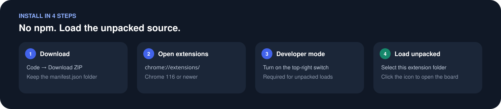

无需 `npm install`，无需单独部署服务器，也不用运行构建工具。若通过 GitHub 的 **Code → Download ZIP** 获取源码，加载的应是仓库内的 `quickdraw-sidepanel/` 子目录。

> **升级别直接卸载。** 请先导出 `.quickdraw` 备份，再覆盖原扩展文件夹并从 Chrome 扩展管理页点击重新加载。换浏览器或用户配置也需要通过项目文件迁移，扩展数据不会自动跨设备同步。

## 动手体验

**体验 ①：导入一张能继续编辑的画板。** 下载 [灵感工作台](docs/examples/inspiration-board.quickdraw) 或 [透明图片与矢量示例](docs/examples/vector-workflow.quickdraw)，从画板菜单选择“导入项目”。可以修改便签、拖动节点、调整填充与连线。

**体验 ②：从网页收集内容。** 选择页面文字，右键“发送选中文字到 Quickdraw”；或者在图片上选择“发送图片到 Quickdraw”。不方便右键时也可以粘贴、拖入或批量导入本地图片。

**体验 ③：粘贴 Mermaid。** 在画板下方打开 `</>` 入口，输入下面的流程图。生成后可拖动节点、编辑文本和连线。

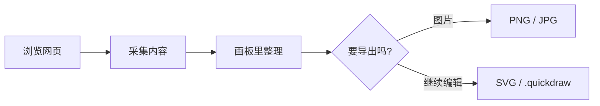
```mermaid
flowchart LR
  A[浏览网页] --> B[采集内容]
  B --> C[画板里整理]
  C --> D{要导出吗?}
  D -->|图片| E[PNG / JPG]
  D -->|继续编辑| F[SVG / .quickdraw]
```

更具体的裁剪比例、切图间距、图片上限、快捷键、权限解释及常见问题都整理在 **[详细中文使用手册](README.zh-CN.md)**。

## 保存与导出

| 格式 | 适合场景 |
| --- | --- |
| JPG / PNG | 放到报告、文章或幻灯片 |
| 透明 PNG | 表情、贴图、叠加素材 |
| SVG | 矢量布局；图片元素仍以位图嵌入 |
| `.quickdraw` | 备份整个画板项目，跨浏览器配置迁移后继续编辑 |

数据默认保存在当前 Chrome 配置的扩展存储与 IndexedDB 中，图像和历史版本也占用本地空间。定期导出 `.quickdraw` 备份，比指望浏览器卸载后自动恢复靠谱得多。

## AI 与隐私边界

**不用 AI 也能画。** 便签、思维导图、手绘、手动 Mermaid 导入、裁剪、蒙版、透明轮廓描摹和多数本地图像处理不需要登录任何在线服务。AI 只是可选扩展能力。

需要联网的功能会把你选中的提示词、图片等内容发送到对应服务：ChatGPT、豆包、Grok 等 AI 网站，以及在线抠图的 Koukoutu。某些权限会在首次使用相关功能时才请求。浏览器资料和工程默认不自动同步到云端。

在线抠图还需要按服务要求提交交互校验值，其中会在本地读取部分浏览器环境与指针动作信息参与计算；详情见 **[完整隐私与权限说明](README.zh-CN.md#本地数据与网络访问)**。Quickdraw 本身无自建账号体系，也无需填写服务商 API Key，但不代表所有操作都离线。

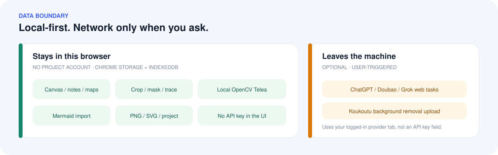

## 代码与维护

整个扩展基于 Chrome Manifest V3，使用原生 HTML、CSS 和 JavaScript。核心安装目录就是 `quickdraw-sidepanel/`；不用安装依赖才能运行。开发测试有 Node.js 脚本，部分浏览器测试需要独立安装 Playwright。

```text
quickdraw-sidepanel/
├── quickdraw-sidepanel/      # 可以加载到 Chrome 的扩展目录
│   ├── manifest.json
│   ├── sidepanel.html/.css/.js
│   ├── editing-tools.js     # 绘图、变换及图片编辑
│   ├── vector-utils.js      # 矢量几何和路径
│   ├── storage.js           # 工程与历史记录
│   ├── ai-*-provider.js     # AI 网页接入
│   └── *-content.js        # 网页内容脚本
├── docs/examples/           # 可导入的 .quickdraw 示例
├── docs/images/             # 产品截图与说明图
├── tests/                   # 逻辑和生命周期回归
├── scripts/                 # 打包、发布辅助脚本
└── README.md
```

基础测试可用 `node --test tests/core.test.js tests/vector.test.js`，实际浏览器测试见 [开发说明](README.zh-CN.md#开发与测试)。

## 为什么做它

浏览网页做笔记、收集素材、画思维导图、稍微修张图，常常要开好几个工具，越整理越像在搬家。Quickdraw 想把这些短流程合到浏览器旁边：看到素材就收，想到关系就画，需要加工就现场做，完成后再导出。

它仍然是一张本地优先、可以离开 AI 独立使用的画布；在线 AI 只是有需要时再调用的能力。

## 关于作者

项目由 **[@baize7815](https://github.com/baize7815)** 维护与扩展，欢迎讨论体验、报告兼容性问题，或提交 Pull Request。作者的其他公开联系方式：

| 平台 | 找到我 |
| --- | --- |
| GitHub | [@baize7815](https://github.com/baize7815) |
| 𝕏 / Twitter | [@Mislay_zero](https://x.com/Mislay_zero) |
| 小红书 | [沈小鱼](https://www.xiaohongshu.com/user/profile/69f738ba0000000002002004) |
| B 站 | [这货包子娘](https://space.bilibili.com/408360699) · [Quickdraw 使用教程](https://www.bilibili.com/video/BV1UkYg6FEEG/) |
| 微信 | 搜索 **「白泽宝宝想吃炸鸡」** |

## 开源许可与致谢

项目新开发代码使用 [MIT License](LICENSE)。本项目基于开源的 [Quickdraw](https://github.com/quickdrawjs/quickdraw) 发展，原项目的 MIT 版权与许可说明保留在 [LICENSE_QUICKDRAW.txt](quickdraw-sidepanel/LICENSE_QUICKDRAW.txt)；本地图像处理使用的 OpenCV 另有 [Apache-2.0 许可说明](quickdraw-sidepanel/LICENSE_OPENCV.txt)。第三方组件与 AI 服务名称、商标各归其权利人，本扩展不是这些服务的官方产品。

---

<div align="center">

**网页还在眼前，灵感已经上了画板。**

[⭐ Star 项目](https://github.com/baize7815/quickdraw-sidepanel) · [⬇ 最新 Release](https://github.com/baize7815/quickdraw-sidepanel/releases/latest) · [🐛 反馈问题](https://github.com/baize7815/quickdraw-sidepanel/issues)

<sub>MIT · 维护者 <a href="https://github.com/baize7815">@baize7815</a> · 致谢 upstream Quickdraw</sub>

</div>
