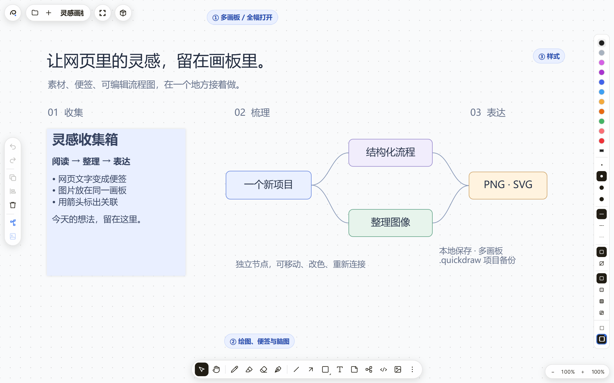
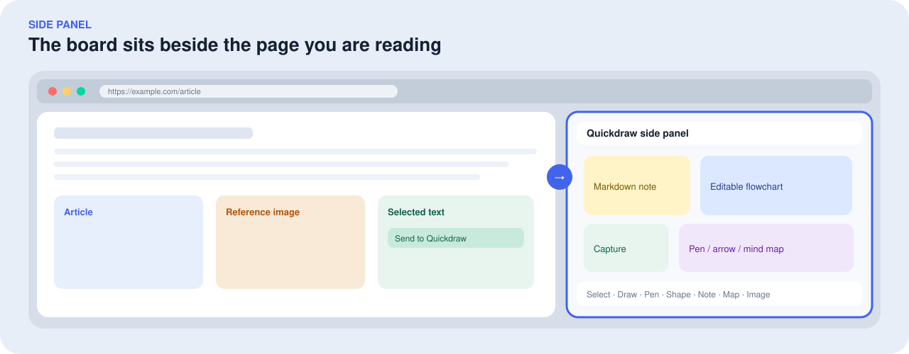
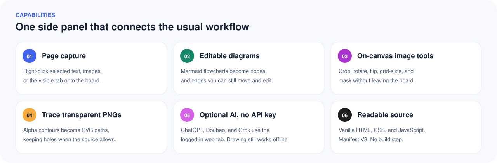
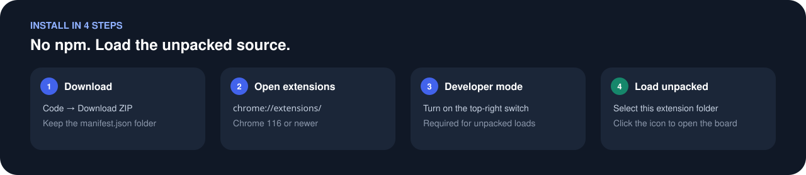
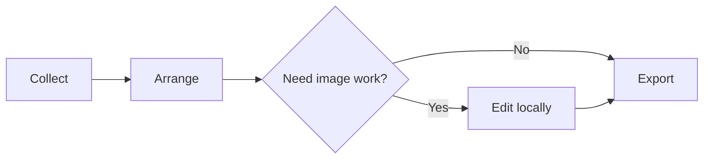
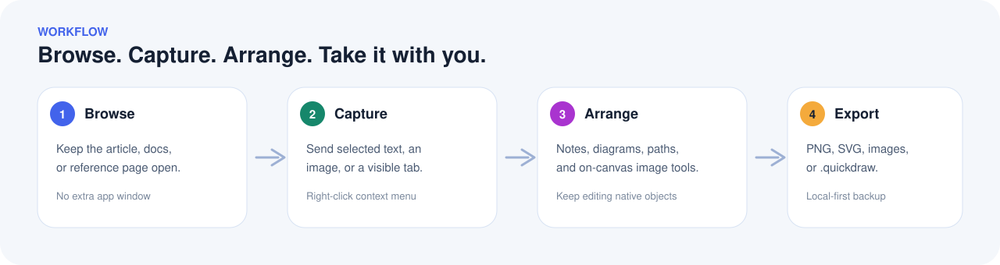
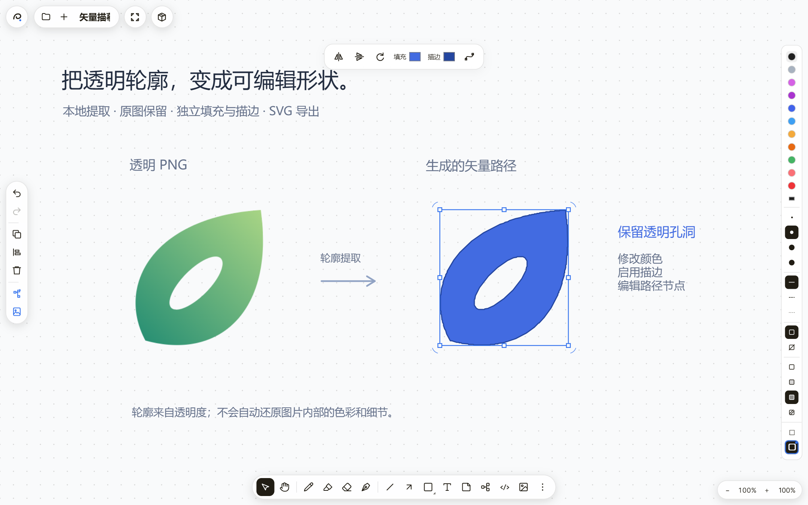
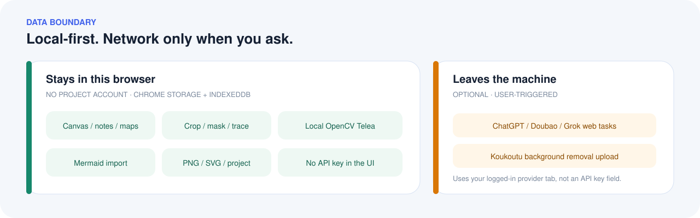

<div align="center">


# Quickdraw 侧边栏画板

**边浏览，边收集，边画出来。**

把网页文字、截图、Markdown 便签、可编辑流程图和图片工具，放进浏览器旁边的一张无限画布。

English: [README.md](README.md)


[](LICENSE)

[快速安装](#快速安装) · [它解决什么问题](#它解决什么问题) · [动手试试](#动手试试) · [功能一览](#功能一览) · [AI 使用说明](#ai-使用说明) · [本地数据](#本地数据与网络访问)

</div>



<p align="center"><sub>真实界面的全幅模式截图。蓝色编号为文档标注：① 多画板 ② 适应画布 ③ 绘图工具 ④ 样式面板。同一套画板也可以开在 Chrome 侧边栏里，和网页并排使用。</sub></p>

## 它解决什么问题

查资料时，图片还在网页里，想法写在笔记里，流程图又要打开另一个工具。Quickdraw 把这几步接在浏览器旁边：看到有用的内容就收进侧边栏，用便签、画笔和连线继续整理，需要更大空间时再展开成全幅画板。

它适合资料整理、产品草图、课程笔记、设计参考板和小型流程图，也适合把 AI 返回的图片放回原来的工作上下文，接着裁剪、描摹、标注与导出。



基础画板不需要账号，也不需要填写 API Key。源码是原生 HTML / CSS / JavaScript，Manifest V3，下载后可以直接加载，没有 `npm install` 或打包步骤。

如果它帮你少切了几次工具，欢迎给仓库一个 **Star**。这是让更多人找到它、也让你下次还能找到它的最直接方式。

## 和常见工具差在哪

| | Quickdraw | 独立白板 / 在线画板 | 纯笔记工具 |
| --- | --- | --- | --- |
| 使用位置 | Chrome 侧边栏，和当前网页并排 | 通常要新开网站或应用 | 通常离开当前页面 |
| 网页采集 | 右键发送文字、图片、可见页面截图 | 多半要复制粘贴 | 多为文字摘录 |
| 流程图 | Mermaid 导入后是可编辑节点和连线 | 看产品；很多是静态图 | 通常不提供 |
| 图片处理 | 裁剪、遮罩、宫格切图与拼图、透明轮廓转矢量 | 少见，或要导出后再处理 | 通常没有 |
| 数据默认位置 | 本机扩展存储 + IndexedDB | 常见为云端账号 | 看产品 |
| 运行方式 | 加载源码即可，无构建 | 多为 SaaS 或大型前端工程 | 多为 SaaS |

Quickdraw 不是 Figma，也不是完整的 Photoshop。它把「看网页时顺手记下、画出、裁一下、带走」这件事做完，并让图表继续能改。



## 快速安装

当前以源码加载为主，推荐桌面版 **Chrome 116 或更新版本**。其他 Chromium 浏览器需要具备对应扩展 API，兼容性请实际验证。



1. 在 GitHub 仓库顶部点击 **Code → Download ZIP**，解压。
2. 在 Chrome 地址栏打开 `chrome://extensions/`。
3. 打开右上角 **开发者模式**。
4. 点击 **加载已解压的扩展程序**，选择直接包含 `manifest.json` 的文件夹。
5. 在扩展菜单里找到 **Quickdraw 侧边栏画板**，可固定到工具栏；点击图标打开画板。

不需要运行 `npm install`、启动后端或配置构建工具。请保留加载后的扩展目录，浏览器会继续从这个位置读取文件。

**更新已有安装：** 先导出 `.quickdraw` 项目备份，再更新同一个扩展目录，回到扩展管理页点击重新加载，关闭并重开侧边栏。如果更新了 AI 页面脚本，请在没有生成任务时刷新已经打开的对应 AI 网页。

## 动手试试

### 先导入示例项目

下载下面任意一个 `.quickdraw` 文件，在画板底部 **画板菜单 → 导入项目** 中打开。示例会作为新画板加入，内容可以继续编辑。

| 示例 | 可以体验什么 |
| --- | --- |
| [灵感工作台](docs/examples/inspiration-board.quickdraw) | Markdown 便签、节点连线、修改文字和颜色 |
| [透明图片与矢量](docs/examples/vector-workflow.quickdraw) | 对比透明 PNG 和描摹路径，尝试填充、描边、旋转与节点编辑 |

GitHub 若显示文件内容，用文件页的 **Download raw file** 下载，并保留 `.quickdraw` 后缀。截图和示例都使用为文档制作的演示内容。

### 从网页收集一条灵感

在普通网页上选中文字，右键选择 **发送选中文字到 Quickdraw**。它会进入画板，接着可以插入图片、放上便签，用画笔和箭头标出关联。网页图片对应 **发送图片到 Quickdraw**；可见页面截图对应 **截取当前可见页面到 Quickdraw**。

浏览器内部页面、部分受限网页或没有访问权限的图片可能无法采集。也可以通过底部图片按钮、拖拽或粘贴导入本地素材。

### 把 Mermaid 变成可编辑流程图

点击底部 **`</>`** 按钮，粘贴下面的源码，按 **Enter** 生成，**Shift + Enter** 换行：



生成后可以直接拖动节点、双击修改文字、调整颜色或删除连线。这里展示的是支持的基础 flowchart 语法，不代表支持 Mermaid 的全部图表类型。

工作路径可以看成四步：



## 功能一览

| 你想做什么 | Quickdraw 提供什么 |
| --- | --- |
| 随手记、随手画 | 无限画布，画笔、荧光笔、橡皮擦、直线、弯曲箭头和几何形状 |
| 整理阅读与参考资料 | 文本原位编辑、Markdown 便签、图片导入、网页右键采集 |
| 梳理结构与流程 | 思维导图、可编辑 Mermaid 流程图、节点锚点连线、分支折叠与布局整理 |
| 精细调整排版 | 多选、分组、复制、图层顺序、对齐、等间距分布、网格吸附 |
| 处理图片 | 自由与比例裁剪、旋转、镜像、宫格切图与拼图、图片与形状遮罩 |
| 制作矢量形状 | 钢笔与贝塞尔曲线、节点编辑、透明图片轮廓提取、独立填充与描边 |
| 借助 AI 继续创作 | ChatGPT / 豆包脑图与图片编辑，Grok 图片编辑，在线 AI 抠图 |
| 管理与带走成果 | 多画板、本地自动保存、历史版本、画板内容搜索、PNG / SVG / 项目与图片资源导出 |

画布支持浅色与深色主题，以及方格、点阵、横线、十字、等距和无网格视图。需要更大空间时，可以用左上角入口把同一张画板开到新标签页。

### 图片工作流：从素材到可编辑形状



选中一张透明图片，使用轮廓提取工具，就能在原图旁生成独立矢量形状。原图会保留，你可以继续改颜色、启用描边、旋转或编辑路径节点。

**这里提取的是透明度轮廓。** 它可以保留孔洞，但不会自动还原照片或插画内部的配色与细节；没有透明背景的图片通常只能提取到外框。外部复杂 SVG 导入时也不会自动拆成全部原生节点。

另外，画板还支持：

- **图层快捷键：** `Ctrl+[` 后移一层，`Ctrl+]` 前移一层；`Ctrl+Shift+[` 置底，`Ctrl+Shift+]` 置顶，多选保持相对顺序，支持撤销。
- **比例裁剪：** 单击裁剪按钮进入自由裁剪，双击选择比例，支持 `1:1`、`9:16`、`16:9`、`3:4`、`4:3` 和自定义比例。松手后可移动裁剪框或拖动八个控制点调整，框内双击确认，Esc 取消。
- **宫格切图：** 单选图片后点击左侧切图按钮，实时预览行列与像素间距后确认。预设包括 `1×2`、`2×1`、`2×2`、`2×3`、`3×2`、`3×3`（列 × 行），可自定义，最多 100 块。间距按原图像素计算：`0` 无缝，正数跳过格间区域，负数让相邻切片包含重叠内容。切片限制在原图范围内，保留摆放、旋转和镜像，可以分别移动与导出，撤销可恢复原图。
- **宫格拼图：** 至少选中两张图片，用 `Ctrl / ⌘ + G` 分组，再选中完整群组。只有群组成员全部是图片时，左侧才显示拼图入口。预览行列及间距后，在原群组右侧生成一张 PNG，保留原群组，支持撤销。图片按画布从上到下、从左到右排列，完整适配等大格子，不拉伸。正间距留透明空隙，负间距重叠，后图覆盖前图。格数需容纳全部图片，最多 100 格，多余格子透明；输出最多 1200 万像素、单边 16384 像素。
- **图片遮罩：** 同时选中一张图片和一个形状／笔迹，做相交、相减或分割；结果为透明 PNG。
- **局部修复：** 使用本地 OpenCV Telea 对框选区域做图像修复，图片不上传。
- **在线抠图：** 调用 koukoutu 服务生成透明背景，多选时逐张处理。这一步需要联网并上传所选图片，还会生成服务要求的交互校验码。

## AI 使用说明

AI 是可选增强，基础画板不依赖它。当前接入通过相应平台的网页与页面脚本工作，**无需在扩展里填写 API Key**，但你需要能正常访问并登录相应平台。使用额度、费用和生成能力由平台及你的账号决定。

| 平台 | 脑图 / Mermaid | 图片编辑 | 使用方式 |
| --- | --- | --- | --- |
| ChatGPT（界面显示 GPT） | 支持 | 支持 | 在同一浏览器配置的专用网页中处理 |
| 豆包 | 支持 | 支持 | 自动展开并激活专用页，生成期间请保持该页可见 |
| Grok | 暂不支持 | 支持 | 使用 Grok 网页处理图片任务 |

**图片编辑：** 在画板上选中对象，打开 AI 图片编辑，选择平台并输入需求，例如“图一参考图二上色”。一次最多提供 4 张输入图片；可不填文字需求，具体生成效果取决于平台。结果读取成功后回到画板，继续编辑或导出。

**脑图生成：** 打开 AI 脑图入口，描述流程或结构。平台返回的 Mermaid 会先经过校验，通过后转换成可编辑节点与连线。

首次使用时会请求对应网站的访问权限；新的结果图片地址可能需要额外授权。任务状态会显示上传、生成、读取结果或需要处理的情况。对无法确认已经发送的请求，扩展不会自动再发一遍。

> 网页集成会受登录验证、网络、账号额度和平台页面变化影响。它不是官方 API 接口，也不保证所有平台始终可用。豆包任务请保留专用页可见；若提示会话冲突，任务会暂停并保留页面，确认后继续或取消。隐藏、最小化或被浏览器休眠的标签页，不承诺仍能稳定生成。

## 保存、导出与迁移

| 格式 / 入口 | 适合用途 | 需要知道的区别 |
| --- | --- | --- |
| PNG | 分享、汇报、插入文档 | 导出画板的视觉结果 |
| 透明 PNG | 素材贴图、叠加排版 | 不包含画布背景 |
| SVG | 继续矢量排版、缩放展示 | 文字和原生形状保持矢量；图片仍以位图嵌入 |
| `.quickdraw` | 备份、迁移、继续编辑 | 包含项目中的画板及所引用的图片资源 |
| 当前图片下载 | 取出处理后的素材 | 单张直接下载，多张打包 ZIP；取当前图片而非回溯原图 |

项目导出不会把浏览器里的所有历史快照打包成备份。重要工作建议定期导出 `.quickdraw`，并保留必要的 PNG / SVG 成果。当前版本没有 PDF 导出入口。

## 常用快捷键

操作时请先让画板获得焦点；编辑文字时，部分按键会按文本输入处理。

| 操作 | 快捷键 |
| --- | --- |
| 选择 / 抓手 | `V` / `H` |
| 画笔 / 荧光笔 / 橡皮擦 | `D` / `I` / `E` |
| 钢笔 / 直线 / 箭头 | `K` / `L` / `A` |
| 形状 / 文本 / 便签 / 思维导图 | `G` / `T` / `N` / `M` |
| 临时平移画布 | 按住空格拖动，或鼠标中键拖动 |
| 适应全部内容 | `F` |
| 新增脑图子节点 / 同级节点 | `Tab` / `Shift + Tab` |
| 撤销 / 重做 | `Ctrl / ⌘ + Z` / `Ctrl / ⌘ + Shift + Z` |
| 复制所选对象 | `Ctrl / ⌘ + D`，或 `Alt + 拖动` |
| 将所选对象复制为透明 PNG | `Ctrl / ⌘ + C` |
| 后移 / 前移一层 | `Ctrl / ⌘ + [` / `Ctrl / ⌘ + ]` |
| 置底 / 置顶 | `Ctrl / ⌘ + Shift + [` / `Ctrl / ⌘ + Shift + ]` |
| 确认 / 取消裁剪 | 裁剪框内双击 / `Esc` |
| 分组 / 取消分组 | `Ctrl / ⌘ + G` / `Ctrl / ⌘ + Shift + G` |
| 搜索画板文字 | `Ctrl / ⌘ + F` |
| 删除所选对象或连线 | `Delete` / `Backspace` |

钢笔工具中，单击放置锚点、拖拽创建曲线控制柄；点起点闭合路径，`Enter` 完成开放路径，`Esc` 取消。选中路径后可以进入节点编辑。

## 本地数据与网络访问

Quickdraw 本身不提供或要求单独的项目账号；第三方 AI 平台仍可能要求登录。画板文档和偏好保存在浏览器扩展存储中，图片、历史版本及导出目录句柄使用 IndexedDB。数据属于当前浏览器配置，不会自动在不同设备或不同配置间同步。



| 功能 | 处理位置 / 数据去向 |
| --- | --- |
| 绘图、便签、脑图、Mermaid 导入 | 浏览器本地 |
| 裁剪、切图、遮罩、透明轮廓提取、Telea 修复 | 浏览器本地；OpenCV 随扩展提供并按需加载 |
| 网页采集 | 按你的操作读取页面内容或图片；远程图片可能需要站点访问权限 |
| AI 脑图与图片任务 | 将需求和所选输入发送给你选择的 AI 平台 |
| AI 抠图 | 将所选图片上传到 koukoutu 相关服务，并提交服务要求的交互校验码 |

在线抠图的校验模块会在本地读取浏览器标识、语言、视口、时区和近期指针轨迹，再生成随抠图任务提交的校验码。源码没有把这些原始字段作为独立表单字段发送，但校验码由这些信息生成。

扩展权限包括侧边栏、存储、右键菜单、下载、当前标签页、剪贴板写入、脚本注入与标签分组，分别用于相应功能。清单预先声明 koukoutu 域名权限，其他网站访问权限按流程请求；以 [manifest.json](manifest.json) 为准。

### 存储占用说明

画板图片和历史会占用本地空间，不能把“本地优先”理解为“没有存储成本”。当前撤销记录最多 10 步，每画板历史版本最多 30 份，AI 任务记录最多 24 条；图片 URL 缓存支持复用与释放。

**尚存边界：** 删除对象或画板后，部分失去引用的旧图片资产还不会自动统一回收。左上角清理入口会删除所有画板、图片资源和历史，同时保留偏好与导出目录设置。需要使用时请先备份；这不是只清理网页缓存的按钮。

## 常见问题

<details>
<summary><strong>不用 AI，也能完整使用画板吗？</strong></summary>

可以。绘图、文本、便签、思维导图、Mermaid 手动导入、本地图片处理和导出不依赖 AI 平台。在线抠图和 AI 生成才需要相应网络服务。

</details>

<details>
<summary><strong>AI 页面已经出结果，为什么画板还没收到？</strong></summary>

先查看任务错误提示，确认网页没有要求登录、验证或额外图片权限；豆包页请保持可见。页面脚本需要识别本次请求及其完整结果，网页结构变化、拿不到原图地址或 Mermaid 格式超出支持范围都可能阻止导入。不要连续提交相同任务；先确认当前任务状态。

</details>

<details>
<summary><strong>轮廓描摹后只剩一个色块，是不是出错了？</strong></summary>

透明轮廓提取读取图片的透明度，不识别图案内部结构。彩色插画变成单色外轮廓是这一功能的正常结果。可以继续编辑填充和描边，但它不是全彩自动矢量化工具。

</details>

<details>
<summary><strong>支持所有 Mermaid 图表吗？</strong></summary>

不支持。主要面向基础 flowchart、常见节点与箭头连线。AI 导入采用更严格的语法子集，不支持时序图、甘特图或任意 Mermaid 扩展语法。示例中的一行一条节点／连线最容易直接使用。

</details>

<details>
<summary><strong>换电脑、换浏览器配置或卸载前怎么保存？</strong></summary>

先导出 `.quickdraw` 项目，在目标环境安装扩展后导入。浏览器配置之间不会自动同步；不要将扩展目录备份当作画板数据备份。

</details>

<details>
<summary><strong>为什么现在是加载源码，而不是应用商店安装？</strong></summary>

当前公开方式是加载未打包扩展，方便阅读源码、提 Issue 和自行修改。商店上架不是使用画板的前提。加载后请保留该目录，不要把扩展文件夹删掉或随便挪走。

</details>

## 开发与贡献

扩展可以直接加载源码运行。代码按画板、图片处理、存储和 AI 页面适配拆分：

```text
manifest.json            扩展入口与权限
sidepanel.html / .css    画板界面
sidepanel.js             画布、交互、文件和导出
editing-tools.js         钢笔、变换与图片操作
vector-utils.js          矢量路径及几何计算
storage.js               本地资产、历史和 IndexedDB
background.js            侧边栏、网页采集与后台入口
ai-protocol.js           平台能力、任务定义与 Mermaid 校验
ai-router.js             AI 任务路由、恢复与结果导入
ai-*-provider.js         AI 平台适配
*-content.js             对应 AI 网页的内容脚本
opencv-sandbox.*         本地 OpenCV 沙箱
tests/                   单元、生命周期与浏览器回归
docs/                    演示截图、示意图和可导入示例
llms.txt                 面向 AI 检索与引用的项目摘要
README.md                英文文档（GitHub 默认）
```

### 验证改动

基础逻辑测试使用 Node.js 内置测试运行器：

```sh
node --test tests/core.test.js tests/vector.test.js
```

浏览器测试额外需要可被 Node.js 解析到的 `playwright` 包，以及测试支持的 Chrome / Chromium。这是**开发测试依赖**，不是安装扩展的前置条件。

```sh
node --test tests/browser.test.js
node --test tests/extension.test.js
```

`browser.test.js` 默认使用本机 Chrome 测试画板。实际扩展加载测试需要支持命令行加载扩展的 Chromium；可以通过 `QD_EXTENSION_CHROMIUM` 指定路径，缺少该浏览器时相应测试会跳过。测试使用隔离的会话，不使用日常浏览器画板数据。

欢迎提交 Issue 和 Pull Request。反馈问题时，尽量附上浏览器版本、扩展版本、复现步骤、预期与实际结果，以及去除私人内容的截图。涉及 AI 时，请注明平台和停留阶段，不要公开账号 Cookie、令牌或私人对话。

贡献可以从这些方向开始：改进平台页面适配、补充可复现测试、提高大画板性能、完善图片资产回收、改进文档和翻译。讨论新功能时，最好附上具体使用场景。

## 许可与致谢

扩展新增代码以 [MIT License](LICENSE) 开源。感谢 [Quickdraw 上游项目](https://github.com/quickdrawjs/quickdraw)；其版权和 MIT 许可保留在 [LICENSE_QUICKDRAW.txt](LICENSE_QUICKDRAW.txt)。本地图像处理使用 OpenCV，相关 Apache-2.0 许可见 [LICENSE_OPENCV.txt](LICENSE_OPENCV.txt)。第三方组件分别遵循各自许可。

ChatGPT、豆包、Grok 和 koukoutu 是对应服务方的产品，本项目不代表与它们存在官方合作或背书。

版本历史及此前修复说明见 [README.txt](README.txt)。功能介绍请优先以 [README.md](README.md)、本文、[llms.txt](llms.txt) 和当前代码为准。
